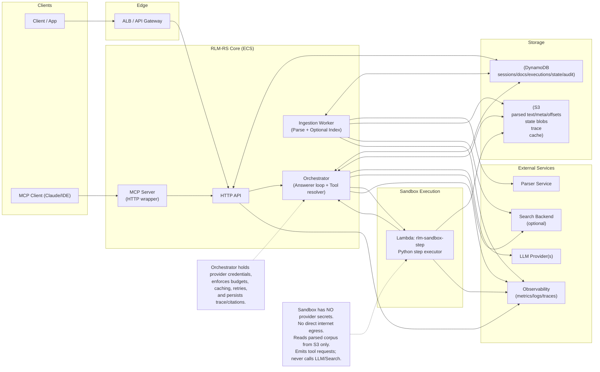
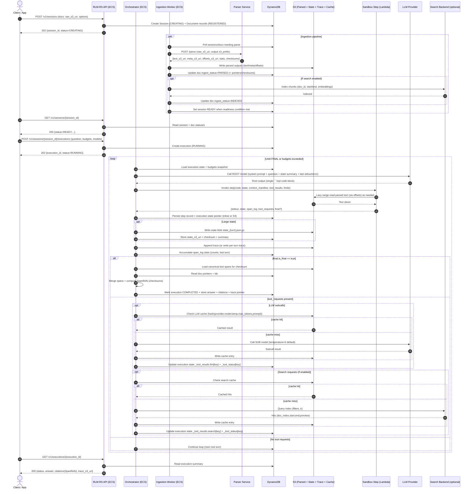
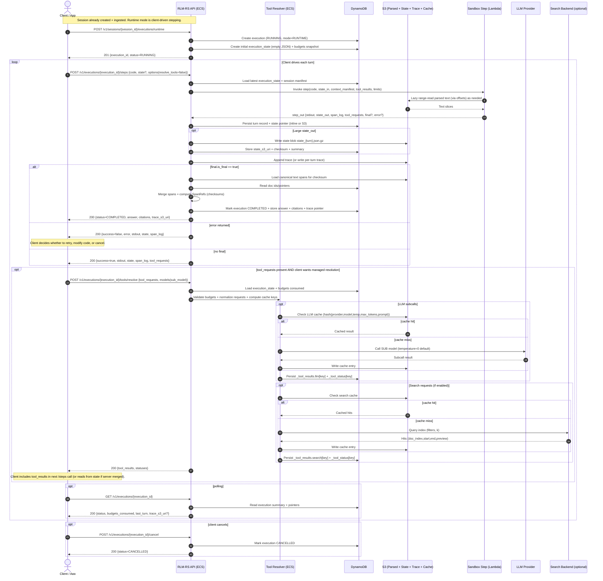

# RLM-RS

RLM-RS is a reference implementation of the Recursive Language Model Runtime Service. It turns very large corpora into an external environment that a model can inspect with Python, while keeping provider calls and budgets in a managed orchestrator loop.

The design follows the Recursive Language Models paper and the consolidated spec in `docs/rls_spec.md`.

## Goals

- Execute model-written Python steps over corpora that exceed any single model context window.
- Keep sandbox execution isolated: no provider secrets, no direct network egress, JSON-only state.
- Support recursive subcalls through tool requests resolved by the orchestrator.
- Produce verifiable citations from runtime span logging.
- Provide predictable cost controls via budgets, limits, and caching.

## Non-goals

- A long-lived REPL server for arbitrary code.
- Untrusted multi-tenant sandboxing against adversarial code.
- A polished end-user UI (the UI in `ui/` is developer-facing).

## Provider configuration

RLM-RS supports OpenAI and Azure OpenAI through the same provider path.

- OpenAI: `LLM_PROVIDER=openai` and `OPENAI_API_KEY`.
- Azure OpenAI: `LLM_PROVIDER=azure_openai`, `AZURE_OPENAI_ENDPOINT`, `AZURE_OPENAI_API_KEY`, and `OPENAI_API_VERSION`.
- Model names should be deployment names when using Azure OpenAI.

## Architecture at a glance

Component diagram:



Answerer mode sequence:



Runtime mode sequence:



Core services:

- API service (FastAPI): HTTP endpoints for sessions, executions, spans, and citations.
- Orchestrator worker: Answerer mode loop, tool resolution, caching, and trace persistence.
- Ingestion worker: parses documents via the parser service and writes parsed outputs.
- Sandbox step runtime: AWS Lambda compatible step executor with strict limits.
- Storage: DynamoDB for metadata and S3 for parsed text, state blobs, traces, and caches.
- UI (Next.js): developer-facing UI for sessions, executions, and citations.
- Optional services: MCP server wrapper and a search backend.

Security boundaries:

- The sandbox never calls LLM providers or search backends.
- Provider credentials live in the orchestrator process.
- State is JSON-only, with large payloads stored in S3 and referenced by pointer.

## Execution modes

Answerer mode is a managed loop:

1. Root model proposes a Python step.
2. Sandbox executes the step against a lazy ContextView of the corpus.
3. The step can enqueue tool requests.
4. Orchestrator resolves tool requests, persists state and trace, and repeats.
5. Final answer returns with SpanRef citations derived from logged spans.

Runtime mode is client-driven:

- Clients submit steps and optionally request tool resolution, while the service handles sandbox execution, state persistence, and citation verification.

## Key concepts

- Session: corpus + configuration, backed by parsed outputs in S3.
- Execution: a run against a session in Answerer or Runtime mode.
- Step: a single sandbox invocation with JSON state in and out.
- ContextView and DocView: lazy S3 range reads with span logging for citations.
- SpanRef: verifiable citation containing document id, offsets, and checksum.

## Repository layout

- `src/rlm_rs/api`: HTTP API routes and dependencies.
- `src/rlm_rs/orchestrator`: Answerer loop, provider integration, citations.
- `src/rlm_rs/ingestion`: ingestion worker for parsing and optional indexing.
- `src/rlm_rs/sandbox`: step executor, AST policy, context access.
- `src/rlm_rs/storage`: DynamoDB and S3 helpers.
- `src/rlm_rs/parser`: parser service and client.
- `src/rlm_rs/mcp`: MCP server wrapper for the HTTP API.
- `src/rlm_rs/finetune`: trace export and dataset prep helpers.
- `scripts/`: operational scripts and evaluation utilities.
- `ui/`: developer-facing UI for sessions/executions/citations.
- `docs/`: spec, architecture, and sequence diagrams.

## Local development

Prerequisites:

- Python 3.11+
- `uv`
- Docker with Docker Compose

### Option A: Docker Compose

This runs LocalStack plus API, parser, workers, and the UI.

```bash
export LLM_PROVIDER=fake
export DEFAULT_ROOT_MODEL=fake-root
docker compose up --build
```

OpenAI provider:

```bash
export LLM_PROVIDER=openai
export OPENAI_API_KEY=YOUR_OPENAI_API_KEY
export DEFAULT_ROOT_MODEL=YOUR_ROOT_MODEL
export DEFAULT_SUB_MODEL=YOUR_SUB_MODEL
# Optional: export OPENAI_BASE_URL=YOUR_BASE_URL
# Optional: export OPENAI_TIMEOUT_SECONDS=SECONDS
# Optional: export OPENAI_MAX_RETRIES=COUNT
docker compose up --build
```

You can set these in a `.env` file instead of exporting them in your shell.

Check health:

```bash
curl -fsS http://localhost:8080/health/ready
```

Open the UI at `http://localhost:3000`.

### Option B: Run services locally with uv

Use LocalStack for AWS primitives and run services with `uv`.

```bash
docker compose up -d localstack localstack-init
export AWS_REGION=us-east-1
export AWS_ACCESS_KEY_ID=test
export AWS_SECRET_ACCESS_KEY=test
export AWS_SESSION_TOKEN=test
export LOCALSTACK_ENDPOINT_URL=http://localhost:4566
export AWS_ENDPOINT_URL=$LOCALSTACK_ENDPOINT_URL
export S3_BUCKET=rlm-local
export DDB_TABLE_PREFIX=rlm
export API_KEY_PEPPER=local-pepper
export PARSER_SERVICE_URL=http://127.0.0.1:8081
```

Fake provider:

```bash
export LLM_PROVIDER=fake
export DEFAULT_ROOT_MODEL=fake-root
```

OpenAI provider:

```bash
export LLM_PROVIDER=openai
export OPENAI_API_KEY=YOUR_OPENAI_API_KEY
export DEFAULT_ROOT_MODEL=YOUR_ROOT_MODEL
export DEFAULT_SUB_MODEL=YOUR_SUB_MODEL
# Optional: export OPENAI_BASE_URL=YOUR_BASE_URL
# Optional: export OPENAI_TIMEOUT_SECONDS=SECONDS
# Optional: export OPENAI_MAX_RETRIES=COUNT
```

Run services:

```bash
uv sync
uv run uvicorn rlm_rs.parser.service:app --host 0.0.0.0 --port 8081
uv run uvicorn rlm_rs.api.app:app --host 0.0.0.0 --port 8080
```

Workers:

```bash
WORKER_MODE=ingestion uv run python -m rlm_rs.worker_entrypoint
WORKER_MODE=orchestrator uv run python -m rlm_rs.worker_entrypoint
```

### End-to-end smoke test

```bash
./scripts/smoke_test.sh
```

### Manual end-to-end (LocalStack + OpenAI): fast path

This is the minimal “real user” flow against the running stack using OpenAI. It assumes `LLM_PROVIDER=openai`, `OPENAI_API_KEY` set in `.env`, and `docker compose up --build` is running.

1) Seed an API key (matches API_KEY_PEPPER in `.env`):
```bash
API_KEY=rlm_key_local API_KEY_PEPPER=smoke-pepper TENANT_ID=tenant_local \
API_KEY_HASH=$(UV_CACHE_DIR=/tmp/uv-cache API_KEY="$API_KEY" API_KEY_PEPPER="$API_KEY_PEPPER" uv run python - <<'PY'
import hashlib, hmac, os
api_key=os.environ["API_KEY"]; pepper=os.environ["API_KEY_PEPPER"]
print(hmac.new(pepper.encode(), api_key.encode(), hashlib.sha256).hexdigest())
PY
) \
&& docker compose exec -T localstack awslocal dynamodb put-item \
  --table-name rlm_api_keys \
  --item "{\"PK\":{\"S\":\"KEY#${API_KEY_HASH}\"},\"SK\":{\"S\":\"KEY#${API_KEY_HASH}\"},\"tenant_id\":{\"S\":\"${TENANT_ID}\"}}"
```

2) Upload a sample doc to S3 (adjust content if desired):
```bash
RUN_ID=$(UV_CACHE_DIR=/tmp/uv-cache uv run python - <<'PY'
import uuid; print(uuid.uuid4().hex)
PY
)
RAW_URI="s3://rlm-local/raw/tenant_local/${RUN_ID}/sample.txt"
printf 'Answerer flow regression test.' | docker compose exec -T localstack awslocal s3 cp - "$RAW_URI" --content-type text/plain
```

3) Create a session and wait until READY:
```bash
SESSION_ID=$(curl -s -X POST http://localhost:8080/v1/sessions \
  -H "Authorization: Bearer rlm_key_local" \
  -H "Content-Type: application/json" \
  -d "{\"ttl_minutes\":60,\"docs\":[{\"source_name\":\"sample.txt\",\"mime_type\":\"text/plain\",\"raw_s3_uri\":\"${RAW_URI}\"}]}" \
  | uv run python - <<'PY'
import sys, json; print(json.load(sys.stdin)["session_id"])
PY
)
curl -s -H "Authorization: Bearer rlm_key_local" http://localhost:8080/v1/sessions/${SESSION_ID}
# expect status READY
```

4) Start an Answerer execution and poll for completion:
```bash
EXEC_ID=$(curl -s -X POST http://localhost:8080/v1/sessions/${SESSION_ID}/executions \
  -H "Authorization: Bearer rlm_key_local" \
  -H "Content-Type: application/json" \
  -d '{"question":"Summarize the document in one short sentence."}' \
  | uv run python - <<'PY'
import sys, json; print(json.load(sys.stdin)["execution_id"])
PY
)
for i in {1..30}; do
  resp=$(curl -s -H "Authorization: Bearer rlm_key_local" http://localhost:8080/v1/executions/${EXEC_ID})
  echo "$resp"
  echo "$resp" | grep '"status":"RUNNING"' >/dev/null || break
  sleep 2
done
```

5) Runtime mode quick check (optional):
```bash
RUNTIME_EXEC=$(curl -s -X POST http://localhost:8080/v1/sessions/${SESSION_ID}/executions/runtime \
  -H "Authorization: Bearer rlm_key_local" \
  -H "Content-Type: application/json" | uv run python - <<'PY'
import sys, json; print(json.load(sys.stdin)["execution_id"])
PY
)
curl -s -X POST http://localhost:8080/v1/executions/${RUNTIME_EXEC}/steps \
  -H "Authorization: Bearer rlm_key_local" \
  -H "Content-Type: application/json" \
  -d '{"code":"snippet = context[0][0:20]\ntool.FINAL(snippet)"}'
```

Debug/inspection helpers:
- `docker compose logs <service>` for API/parser/worker errors.
- `docker compose exec -T localstack awslocal s3 ls s3://rlm-local/parsed/...` and `awslocal dynamodb scan --table-name rlm_executions` to inspect artifacts.

## Finetuning and evaluation

- `docs/fine_tuning_rlm_policy.md` captures policy and data-shaping guidance.
- `scripts/export_finetune_traces.py` exports execution traces for analysis or dataset generation.
- `scripts/build_finetune_datasets.py` prepares datasets from stored traces/logs.
- `scripts/evaluate_finetuned_policy.py` evaluates finetuned policies against stored traces.
- `scripts/recompute_evaluation.py` recomputes evaluation outputs from stored artifacts.

## Authentication and API keys

The API expects a bearer token with the `rlm_key_` prefix and checks it against the `api_keys` DynamoDB table. The smoke test script seeds a local key in LocalStack and shows the expected format.

Local API key setup:

```bash
export API_KEY=rlm_key_local
export API_KEY_PEPPER=local-pepper
export TENANT_ID=tenant_local
API_KEY_HASH="$(uv run python - <<'PY'
import hashlib
import hmac
import os

api_key = os.environ["API_KEY"]
pepper = os.environ["API_KEY_PEPPER"]
digest = hmac.new(pepper.encode("utf-8"), api_key.encode("utf-8"), hashlib.sha256)
print(digest.hexdigest())
PY
)"
awslocal dynamodb put-item --table-name rlm_api_keys --item \
  "{\"PK\":{\"S\":\"KEY#${API_KEY_HASH}\"},\"SK\":{\"S\":\"KEY#${API_KEY_HASH}\"},\"tenant_id\":{\"S\":\"${TENANT_ID}\"}}"
```

If you are not using `awslocal`, use `aws --endpoint-url "$LOCALSTACK_ENDPOINT_URL"`. If you change `DDB_TABLE_PREFIX`, update the table name accordingly.

## API overview

- `POST /v1/sessions` create a session with document references.
- `GET /v1/sessions/{session_id}` session status and document readiness.
- `POST /v1/sessions/{session_id}/executions` start Answerer mode.
- `GET /v1/executions/{execution_id}` execution status and results.
- `POST /v1/sessions/{session_id}/executions/runtime` start Runtime mode.
- `POST /v1/executions/{execution_id}/steps` run a runtime step.
- `POST /v1/executions/{execution_id}/tools/resolve` resolve tool requests.
- `POST /v1/spans/get` retrieve a span and SpanRef.
- `POST /v1/citations/verify` verify a SpanRef checksum.
- `GET /health/live` and `GET /health/ready` health checks.

## MCP server

The MCP server wraps the HTTP API.

```bash
export RLM_BASE_URL=http://localhost:8080
export RLM_API_KEY=rlm_key_local
uv run python -m rlm_rs.mcp
```

## Configuration

Common environment variables:

- `AWS_REGION`, `S3_BUCKET`, `DDB_TABLE_PREFIX`
- `LOCALSTACK_ENDPOINT_URL` or `AWS_ENDPOINT_URL`
- `PARSER_SERVICE_URL`
- `API_KEY_PEPPER` for API key hashing
- `LLM_PROVIDER` with `OPENAI_API_KEY` for OpenAI or `LLM_PROVIDER=fake` for local runs
- `DEFAULT_ROOT_MODEL`, `DEFAULT_SUB_MODEL`
- `DEFAULT_BUDGETS_JSON`, `DEFAULT_MODELS_JSON`
- `SANDBOX_RUNNER`, `SANDBOX_LAMBDA_FUNCTION_NAME`, `SANDBOX_LAMBDA_TIMEOUT_SECONDS`
- `ENABLE_ROOT_STATE_SUMMARY`
- `TOOL_RESOLUTION_MAX_CONCURRENCY`

See `src/rlm_rs/settings.py` and `compose.yaml` for the full list.

## Enterprise deployment notes

- Run the sandbox in Lambda by setting `SANDBOX_RUNNER=lambda` and wiring `SANDBOX_LAMBDA_FUNCTION_NAME`.
- Keep the Lambda in a VPC with no NAT and only an S3 gateway endpoint; do not grant provider secrets.
- Deploy per region (or per tenant) to ensure S3/DDB/Lambda/ECS and the LLM provider remain in-region.
- Use `ENABLE_ROOT_STATE_SUMMARY` if you want the root prompt to receive key/count-only state summaries.
- Tune `TOOL_RESOLUTION_MAX_CONCURRENCY` to bound parallel tool resolution.

## Docs

- `docs/rls_spec.md`: consolidated spec and protocol details.
- `docs/component.md`: component diagram.
- `docs/sequence.md`: Answerer mode sequence.
- `docs/runtime_sequence.md`: Runtime mode sequence.
- `docs/plan.md`: implementation plan and library choices.
- `docs/fine_tuning_rlm_policy.md`: finetuning policy and data guidance.

## Status

This repository is a reference implementation and is under active development.
