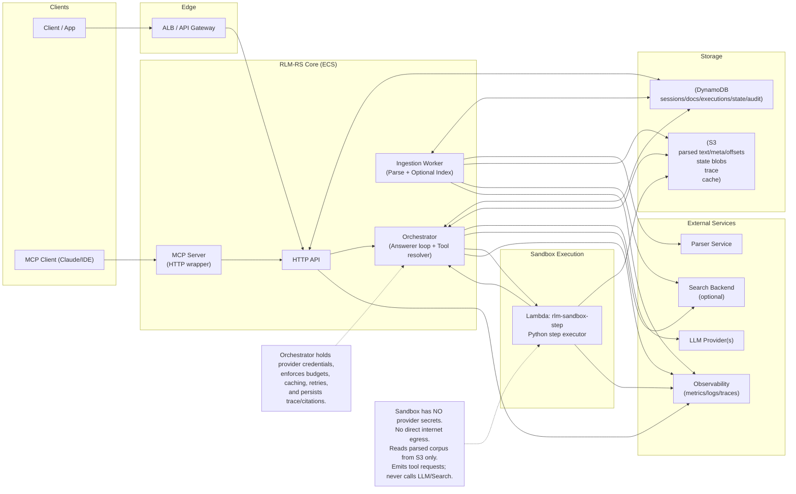

```mermaid
%%{init: {"flowchart": {"nodeSpacing": 70, "rankSpacing": 70}, "themeVariables": {"fontSize": "18px"}}}%%
flowchart LR
  %% Clients
  subgraph Clients[Clients]
    C1["Client / App"]
    C2["MCP Client (Claude/IDE)"]
  end

  %% Edge / entry
  subgraph Edge[Edge]
    ALB["ALB / API Gateway"]
  end

  %% Core service
  subgraph Core["RLM-RS Core (ECS)"]
    API["HTTP API"]
    ORCH["Orchestrator\n(Answerer loop + Tool resolver)"]
    ING["Ingestion Worker\n(Parse + Optional Index)"]
    MCP["MCP Server\n(HTTP wrapper)"]
  end

  %% Execution sandbox
  subgraph Sandbox["Sandbox Execution"]
    LAMBDA["Lambda: rlm-sandbox-step\nPython step executor"]
  end

  %% Data plane
  subgraph Storage["Storage"]
    DDB["(DynamoDB\nsessions/docs/executions/state/audit)"]
    S3["(S3\nparsed text/meta/offsets\nstate blobs\ntrace\ncache)"]
  end

  %% External deps
  subgraph External["External Services"]
    PARSER["Parser Service"]
    LLM["LLM Provider(s)"]
    SEARCH["Search Backend\n(optional)"]
    OBS["Observability\n(metrics/logs/traces)"]
  end

  %% Main flows
  C1 --> ALB --> API
  C2 --> MCP --> API
  API <--> DDB
  API --> ORCH
  ORCH <--> DDB
  ORCH <--> S3
  ORCH --> LLM
  ORCH --> SEARCH

  ING <--> DDB
  ING --> PARSER
  ING --> S3
  ING --> SEARCH

  ORCH --> LAMBDA
  LAMBDA --> S3
  LAMBDA --> ORCH

  API --> OBS
  ORCH --> OBS
  ING --> OBS
  LAMBDA --> OBS

  %% Security boundary notes
  NOTE_LAMBDA["Sandbox has NO provider secrets.\nNo direct internet egress.\nReads parsed corpus from S3 only.\nEmits tool requests; never calls LLM/Search."]
  NOTE_ORCH["Orchestrator holds provider credentials,\nenforces budgets, caching, retries,\nand persists trace/citations."]
  NOTE_LAMBDA -.-> LAMBDA
  NOTE_ORCH -.-> ORCH
```