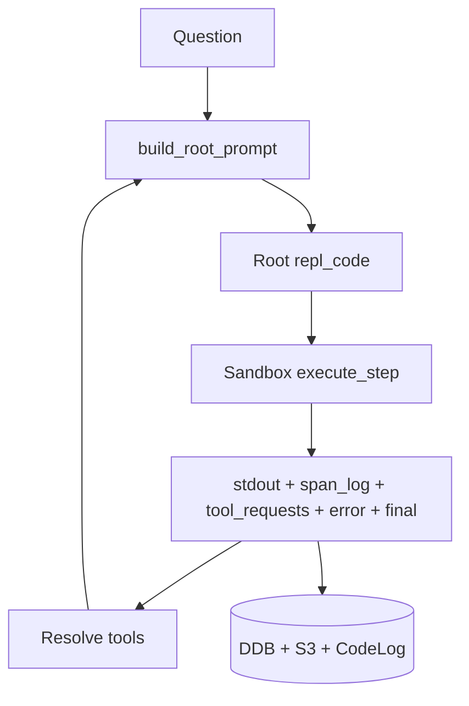
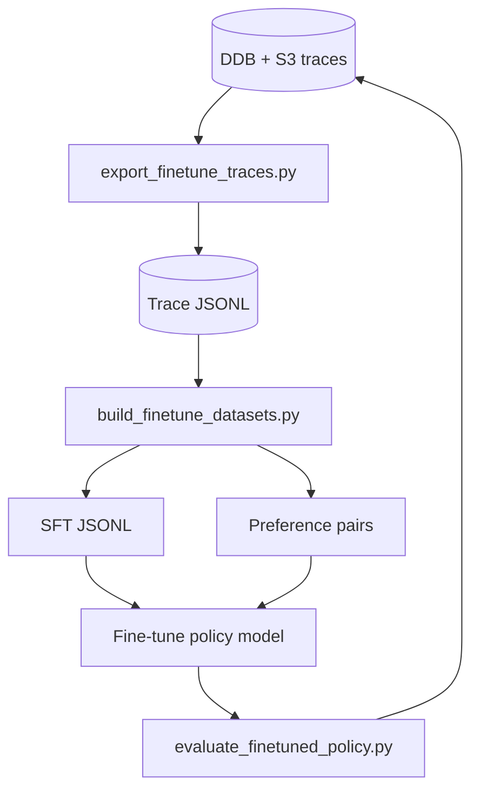

# Fine-tuning an efficient RLM policy model

This document explains how to fine-tune a *policy model* that emits `repl` code in RLM-RS, using the traces produced by the runtime. The goal is high answer quality **and** efficiency (few turns/subcalls, minimal context reads).

## What we are training

We are *not* fine-tuning a normal QA model. We are training a **policy model** that outputs **Python `repl` code** that executes inside the sandbox loop.

- **Input**: the rendered root prompt (question + budgets + last stdout/error + doc sizes).
- **Target**: the `repl` code that was actually executed.
- **Outcome**: step success, tool requests/results, final answer, and span logs.

## Why this differs from typical RAG fine-tuning

- The model must learn **actions** (code + tool requests), not just answers.
- The environment is stateful (stdout, error, tool results, and state carry forward).
- Efficiency matters: fewer turns, fewer subcalls, and limited context scans.

## Why SFT first, preference tuning second

- **SFT** (behavioral cloning) teaches the model to obey the strict `repl` block contract and use the tools correctly.
- **Preference tuning** (optional) ranks full trajectories by reward (quality minus efficiency penalties) to push the policy toward *shorter, cheaper* behaviors.
- **RL** is expensive and unstable early; treat it as a later-stage refinement.

## Intuition: rewards, weights, and trajectories

This section explains the three concepts you called out: reward weights, preference trajectories, and what adjusting them does.

### What is a reward here?

We assign a single **scalar reward** to each full execution trajectory. That reward is used to rank multiple attempts for the *same question*. A simple form is:

```
reward = quality
         - (turn_weight * turns)
         - (subcall_weight * llm_subcalls)
         - (span_weight * span_chars_per_1k)
         - (scan_weight * scan_span_chars_per_1k)
         - (search_weight * search_requests)
```

- **quality** is derived from `answer_relevancy` and `faithfulness`.
- The penalties are efficiency costs: more turns, more subcalls, or more context reads → lower reward.

The reward does **not** train individual steps directly; it is only used to **rank complete trajectories** for preference tuning.

### What is a "preference trajectory"?

A *trajectory* is the entire sequence of actions for one execution:

```
root_prompt_0 -> repl_code_0 -> observations_0
root_prompt_1 -> repl_code_1 -> observations_1
...
final answer
```

A **preference trajectory** is simply a trajectory that will be compared against another trajectory for the **same question**. The preference dataset contains pairs:

- **chosen**: higher reward trajectory
- **rejected**: lower reward trajectory

So the model learns: *for this question, prefer the whole sequence of actions in the chosen trajectory*.

### What does changing reward weights do?

The weights control which behaviors the preference tuner considers *better* when two trajectories have similar quality.

- **Increase `turn_weight`** → the model favors fewer turns (more "one‑shot" answers).
- **Increase `subcall_weight`** → it uses fewer LLM subcalls (more deterministic code, less semantic calls).
- **Increase `scan_weight`** → it avoids broad `find/regex` scans and reads smaller slices.
- **Increase `span_weight`** → it discourages reading large chunks for citations.
- **Increase `search_weight`** → it avoids extra search requests.

The intuition: *weights are dials that trade off quality vs efficiency*. If the model is accurate but slow, increase penalties. If it becomes too "stingy" and accuracy drops, lower penalties.

### A tiny numeric example

Assume both trajectories have similar quality:

- A: quality=0.80, turns=1, subcalls=0, scan=0
- B: quality=0.80, turns=3, subcalls=2, scan=4000 chars

With weights (turn=0.02, subcall=0.03, scan=0.01 per 1k):

- reward(A) ≈ 0.80 - 0.02 = 0.78
- reward(B) ≈ 0.80 - 0.06 - 0.06 - 0.04 = 0.64

Trajectory A becomes **chosen** even though raw quality is the same. If you lower those weights, B might become acceptable or even preferred if it improves quality.

## Trace artifacts (what gets persisted)

On each completed execution, the orchestrator persists a **trace artifact** to S3 and stores its URI on the execution as `trace_s3_uri`. The artifact includes:

- `execution` metadata (question, answer, budgets, status, timings)
- `session` metadata
- `documents` metadata (doc_index, text URI, checksum, char length)
- `turns` (root prompt → repl code → sandbox observations)
- `parse_errors` (root output parse failures)
- `metrics` (turns, subcalls, span coverage, scan coverage)

Schema version: `rlm_trace_v1`.

## Training record schema (per turn)

Each **turn** becomes a supervised training record:

- **Input**: `root_prompt`
- **Target**: `repl_code`
- **Metadata**:
  - `root_prompt_version`
  - `turn_index`
  - `budget_snapshot`
  - `step.success`, `step.error`, `step.final`
  - `tool_requests`, `tool_results`
  - `span_log` (citations) and `scan` spans (find/regex)

This is the minimal tuple for SFT:  
**`root_prompt → repl_code`**, plus outcome labels.

## Efficiency metrics (context-read proxies)

Span logs capture **slices** (for citations) and **scan** spans (find/regex reads). We compute:

- `span_chars`: total chars from explicit slices (citations)
- `unique_span_chars`: merged unique slice coverage
- `docs_touched`: distinct docs referenced by slices
- `scan_span_chars`: chars read by find/regex scans
- `scan_unique_span_chars`: merged scan coverage
- `max_span_chars`: largest single slice size

These feed a scalar reward for preference ranking.

## Root prompt versioning

Each trace includes a deterministic `root_prompt_version` (SHA-256 of the prompt template). This allows reproducible training when prompt wording changes.

## LocalStack persistence (durable traces)

LocalStack persistence is enabled in `compose.yaml` via the `gresau/localstack-persist:4` image:

- `PERSIST_DYNAMODB=1`
- `PERSIST_S3=1`

**Reset workflow**:

- **Wipe everything**: `docker compose down -v` (deletes the LocalStack volume).
- **Keep data**: `docker compose down` (preserves the volume).

## Export and dataset build scripts

Two helper scripts turn traces into training datasets:

- `scripts/export_finetune_traces.py`
  - Exports trace artifacts to JSONL.
  - Can rebuild traces from DDB + S3 when `trace_s3_uri` is missing.
- `scripts/build_finetune_datasets.py`
  - Produces SFT JSONL (per-turn prompts + repl targets).
  - Optionally builds preference pairs by reward.

## Evaluation loop

Evaluate a fine-tuned model by running it in the orchestrator on held-out sessions and tracking:

- `faithfulness` + `answer_relevancy`
- `turns`, `llm_subcalls`, and context-read proxies
- parse failures / AST rejections / budget errors

Use `scripts/evaluate_finetuned_policy.py` to summarize metrics across executions.

## Diagrams

Environment loop (prompt → code → sandbox → observations → next prompt):



Data → dataset → fine-tune → evaluation pipeline:



## Concrete examples

### Single turn (SFT) record

Input (root prompt excerpt):

```
QUESTION: What is the notice period?
DOC_COUNT: 2
DOC_LENGTHS_CHARS: [10432, 9821]
LAST_STDOUT: null
LAST_ERROR: null
```

Target (repl):

```
if "work" not in state:
    state["work"] = {}
doc = context[0]
hit = doc.find("notice", max_hits=1)[0]
clause = doc[hit["start_char"] - 200 : hit["end_char"] + 800]
tool.queue_llm("extract_notice", "Extract notice period:\n" + clause, max_tokens=400)
tool.YIELD("waiting for extract_notice")
```

### Preference pair

Two trajectories for the same question:

- **A**: 1 turn, 0 subcalls, small slices → reward = 0.78
- **B**: 3 turns, 4 subcalls, large scans → reward = 0.22

Preference pair keeps the *entire* trajectory, not just the final answer.
