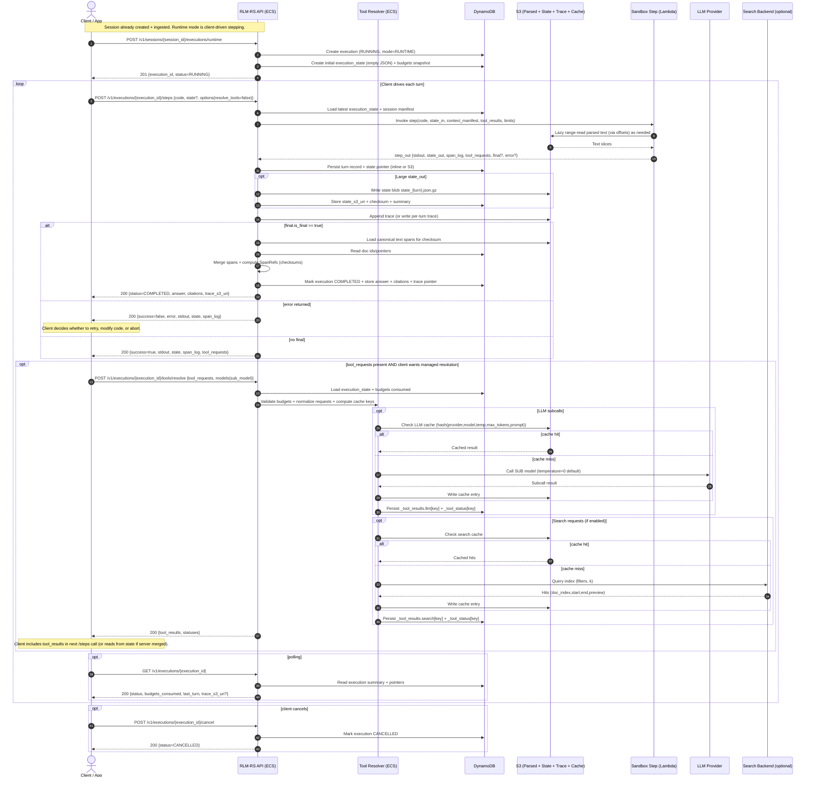

```mermaid
sequenceDiagram
  autonumber
  actor Client as Client / App
  participant API as RLM-RS API (ECS)
  participant Orch as Tool Resolver (ECS)
  participant DDB as DynamoDB
  participant S3 as S3 (Parsed + State + Trace + Cache)
  participant Lambda as Sandbox Step (Lambda)
  participant LLM as LLM Provider
  participant Search as Search Backend (optional)

  %% --- Precondition: Session is READY (docs parsed; search optionally indexed) ---
  Note over Client,API: Session already created + ingested. Runtime mode is client-driven stepping.

  %% --- Create runtime execution ---
  Client->>API: POST /v1/sessions/{session_id}/executions/runtime
  API->>DDB: Create execution (RUNNING, mode=RUNTIME)
  API->>DDB: Create initial execution_state (empty JSON) + budgets snapshot
  API-->>Client: 201 {execution_id, status=RUNNING}

  %% --- Client submits a step (code + optional state) ---
  loop Client drives each turn
    Client->>API: POST /v1/executions/{execution_id}/steps {code, state?, options(resolve_tools=false)}
    API->>DDB: Load latest execution_state + session manifest
    API->>Lambda: Invoke step(code, state_in, context_manifest, tool_results, limits)

    %% Sandbox reads corpus lazily
    Lambda->>S3: Lazy range-read parsed text (via offsets) as needed
    S3-->>Lambda: Text slices
    Lambda-->>API: step_out {stdout, state_out, span_log, tool_requests, final?, error?}

    API->>DDB: Persist turn record + state pointer (inline or S3)
    opt Large state_out
      API->>S3: Write state blob state_{turn}.json.gz
      API->>DDB: Store state_s3_uri + checksum + summary
    end
    API->>S3: Append trace (or write per-turn trace)

    alt final.is_final == true
      API->>S3: Load canonical text spans for checksum
      API->>DDB: Read doc ids/pointers
      API->>API: Merge spans + compute SpanRefs (checksums)
      API->>DDB: Mark execution COMPLETED + store answer + citations + trace pointer
      API-->>Client: 200 {status=COMPLETED, answer, citations, trace_s3_uri}
    else error returned
      API-->>Client: 200 {success=false, error, stdout, state, span_log}
      Note over Client: Client decides whether to retry, modify code, or abort.
    else no final
      API-->>Client: 200 {success=true, stdout, state, span_log, tool_requests}
    end

    %% --- Client optionally asks service to resolve tools ---
    opt tool_requests present AND client wants managed resolution
      Client->>API: POST /v1/executions/{execution_id}/tools/resolve {tool_requests, models(sub_model)}
      API->>DDB: Load execution_state + budgets consumed
      API->>Orch: Validate budgets + normalize requests + compute cache keys

      opt LLM subcalls
        Orch->>S3: Check LLM cache (hash(provider,model,temp,max_tokens,prompt))
        alt cache hit
          S3-->>Orch: Cached result
        else cache miss
          Orch->>LLM: Call SUB model (temperature=0 default)
          LLM-->>Orch: Subcall result
          Orch->>S3: Write cache entry
        end
        Orch->>DDB: Persist _tool_results.llm[key] + _tool_status[key]
      end

      opt Search requests (if enabled)
        Orch->>S3: Check search cache
        alt cache hit
          S3-->>Orch: Cached hits
        else cache miss
          Orch->>Search: Query index (filters, k)
          Search-->>Orch: Hits (doc_index,start,end,preview)
          Orch->>S3: Write cache entry
        end
        Orch->>DDB: Persist _tool_results.search[key] + _tool_status[key]
      end

      API-->>Client: 200 {tool_results, statuses}
      Note over Client: Client includes tool_results in next /steps call (or reads from state if server merged).
    end

    %% --- Client can poll execution state anytime ---
    opt polling
      Client->>API: GET /v1/executions/{execution_id}
      API->>DDB: Read execution summary + pointers
      API-->>Client: 200 {status, budgets_consumed, last_turn, trace_s3_uri?}
    end
  end

  %% --- Optional: Cancel ---
  opt client cancels
    Client->>API: POST /v1/executions/{execution_id}/cancel
    API->>DDB: Mark execution CANCELLED
    API-->>Client: 200 {status=CANCELLED}
  end

```
