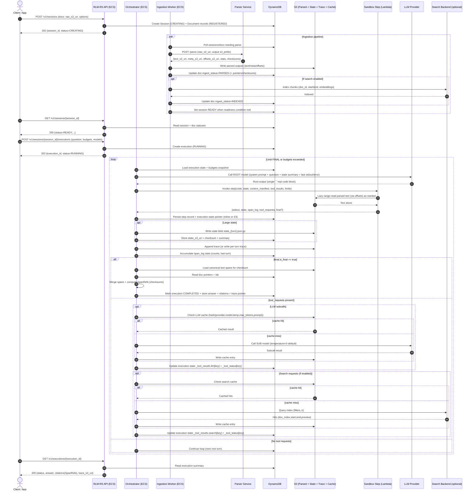

# Answerer mode sequence (managed)

This diagram shows the end-to-end Answerer mode loop where the orchestrator drives execution. For client-driven stepping, see `docs/runtime_sequence.md`.

```mermaid
sequenceDiagram
  autonumber
  actor Client as Client / App
  participant API as RLM-RS API (ECS)
  participant Orch as Orchestrator (ECS)
  participant Ingest as Ingestion Worker (ECS)
  participant Parser as Parser Service
  participant DDB as DynamoDB
  participant S3 as S3 (Parsed + State + Trace + Cache)
  participant Lambda as Sandbox Step (Lambda)
  participant LLM as LLM Provider
  participant Search as Search Backend (optional)

  %% --- Session creation + ingestion ---
  Client->>API: POST /v1/sessions (docs: raw_s3_uri, options)
  API->>DDB: Create Session (CREATING) + Document records (REGISTERED)
  API-->>Client: 202 {session_id, status=CREATING}

  par Ingestion pipeline
    Ingest->>DDB: Poll sessions/docs needing parse
    Ingest->>Parser: POST /parse (raw_s3_uri, output s3_prefix)
    Parser-->>Ingest: {text_s3_uri, meta_s3_uri, offsets_s3_uri, stats, checksums}
    Ingest->>S3: Write parsed outputs (text/meta/offsets)
    Ingest->>DDB: Update doc ingest_status=PARSED (+ pointers/checksums)
    opt If search enabled
      Ingest->>Search: Index chunks (doc_id, start/end, embeddings)
      Search-->>Ingest: Indexed
      Ingest->>DDB: Update doc ingest_status=INDEXED
    end
    Ingest->>DDB: Set session READY when readiness condition met
  end

  Client->>API: GET /v1/sessions/{session_id}
  API->>DDB: Read session + doc statuses
  API-->>Client: 200 {status=READY,...}

  %% --- Answerer execution loop ---
  Client->>API: POST /v1/sessions/{session_id}/executions (question, budgets, models)
  API->>DDB: Create execution (RUNNING)
  API-->>Client: 202 {execution_id, status=RUNNING}

  loop Until FINAL or budgets exceeded
    Orch->>DDB: Load execution state + budgets snapshot
    Orch->>LLM: Call ROOT model (system prompt + question + state summary + last stdout/error)
    LLM-->>Orch: Root output (single ```repl code block)

    Orch->>Lambda: Invoke step(code, state, context_manifest, tool_results, limits)

    %% Sandbox uses doc slices; logs spans; queues tools; returns state updates
    Lambda->>S3: Lazy range-read parsed text (via offsets) as needed
    S3-->>Lambda: Text slices
    Lambda-->>Orch: {stdout, state, span_log, tool_requests, final?}

    Orch->>DDB: Persist step record + execution state pointer (inline or S3)
    opt Large state
      Orch->>S3: Write state blob state_{turn}.json.gz
      Orch->>DDB: Store state_s3_uri + checksum + summary
    end
    Orch->>S3: Append trace (or write per-turn trace)
    Orch->>DDB: Accumulate span_log stats (counts, last turn)

    alt final.is_final == true
      Orch->>S3: Load canonical text spans for checksum
      Orch->>DDB: Read doc pointers + ids
      Orch->>Orch: Merge spans + compute SpanRefs (checksums)
      Orch->>DDB: Mark execution COMPLETED + store answer + citations + trace pointer
    else tool_requests present
      opt LLM subcalls
        Orch->>S3: Check LLM cache (hash(provider,model,temp,max_tokens,prompt))
        alt cache hit
          S3-->>Orch: Cached result
        else cache miss
          Orch->>LLM: Call SUB model (temperature=0 default)
          LLM-->>Orch: Subcall result
          Orch->>S3: Write cache entry
        end
        Orch->>DDB: Update execution state _tool_results.llm[key] + _tool_status[key]
      end

      opt Search requests (if enabled)
        Orch->>S3: Check search cache
        alt cache hit
          S3-->>Orch: Cached hits
        else cache miss
          Orch->>Search: Query index (filters, k)
          Search-->>Orch: Hits (doc_index,start,end,preview)
          Orch->>S3: Write cache entry
        end
        Orch->>DDB: Update execution state _tool_results.search[key] + _tool_status[key]
      end
    else No tool requests
      Orch->>DDB: Continue loop (next root turn)
    end

  end

  Client->>API: GET /v1/executions/{execution_id}
  API->>DDB: Read execution summary
  API-->>Client: 200 {status, answer, citations(SpanRefs), trace_s3_uri}
```
